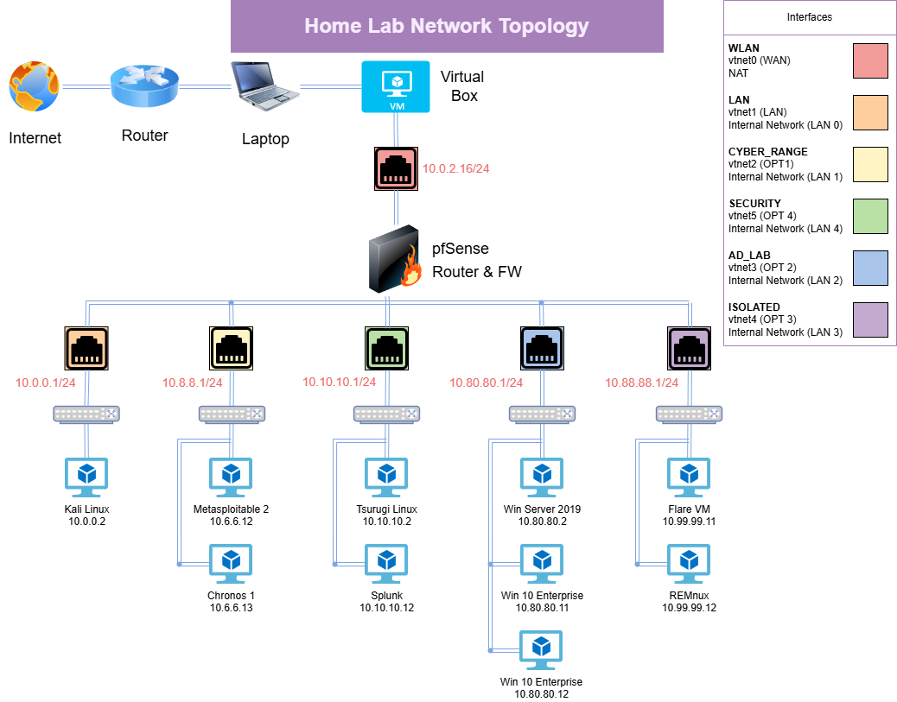

# Cybersecurity Home Lab
This project goes over the different tools used to create a homelab. You can view the network topology for the project in the homelab-network.pdf file. I will be using these repository to store files for all of my projects that I'm completing using my homelab. Below, I will give an overview of the homelab and links to resources so you can create a similar homelab yourself.

